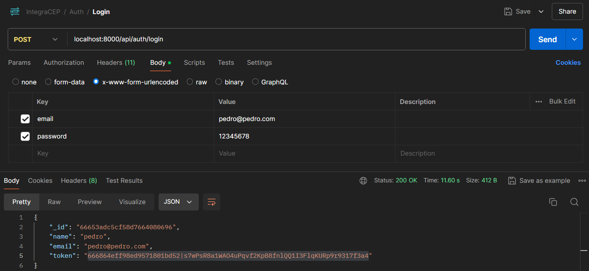
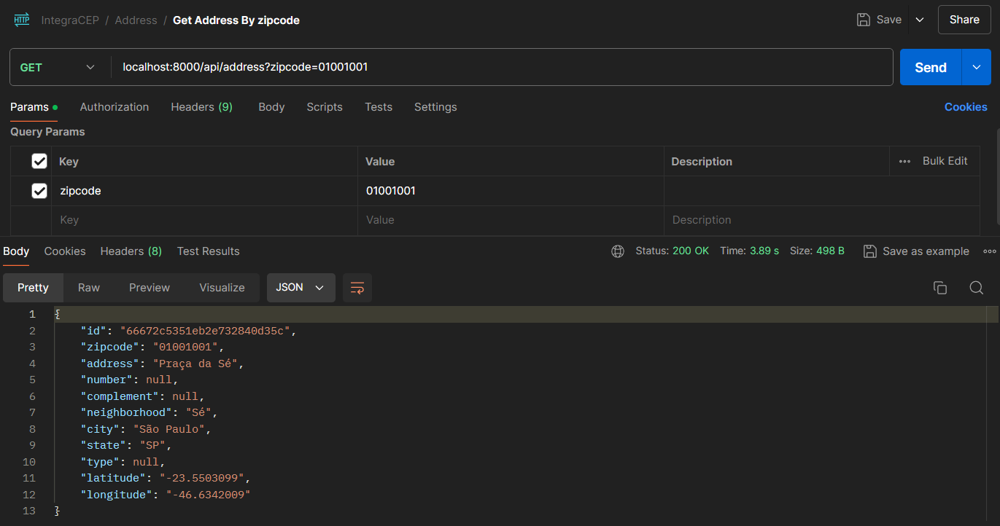
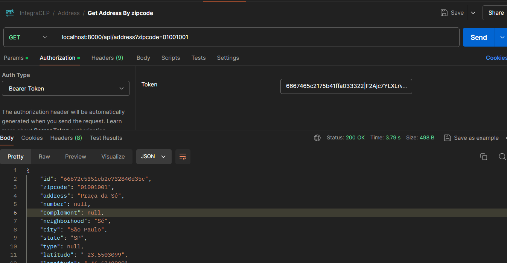

# IntegraCEP SETUP

### Passo a passo
Clonar repositório
```sh
git clone https://github.com/JPedroCavalcante/integra-cep.git integra-cep
```

Acessar pasta do projeto
```sh
cd integra-cep
```

Suba os containers do projeto
```sh
docker-compose up -d
```

Crie o Arquivo .env
```sh
cp .env.example .env
```

Insira as credênciais de usuário que serão utilizadas para se logar
```sh
API_AUTH_USER=
API_AUTH_PASSWORD=
```

(Opcional) Ajuste as credênciais ao banco mongo que você irá utilizar caso não for utilizar o mongoDB do docker compose
```sh
MONGO_DB_HOST=
MONGO_DB_DATABASE=
MONGO_DB_USERNAME=
MONGO_DB_PASSWORD=
MONGO_DB_DATABASE_AUTH=
```

Acesse o container app
```sh
docker-compose exec app bash
```

Instalar pacotes do projeto
```sh
composer install
```

Gere a key do projeto Laravel
```sh
php artisan key:generate
```

Rodar as migrations e seeds
```sh
php artisan migrate:fresh --seed
```

Gerar seu token de acesso a API

Supondo que as variavéis de autenticação foram:
```env
API_AUTH_USER=pedro
API_AUTH_PASSWORD=12345678
```



#### Endpoint de login:
- [http://localhost:8000/auth/login](http://localhost:8000/auth/login)


Consultando um CEP



Lembrando de utilizar o token de acesso a API



### Endpoint consulta de endereço:
- [http://localhost:8000/api/address?zipcode=01001001](http://localhost:8000/api/address?zipcode=01001001)
